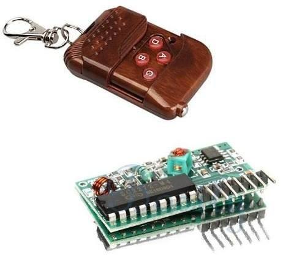
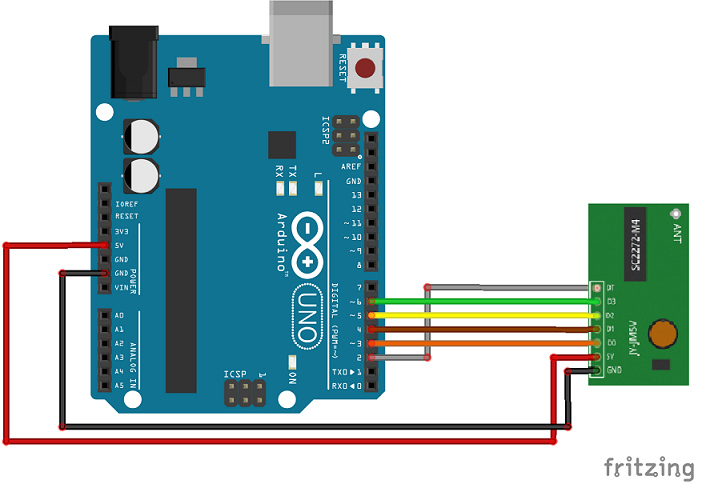

# Wireless Remote Controller Library for Arduino
   

## What is it

This library (with examples) is designed to be integrated in projects using IC2272/2262 (315MHz and 433MHz) remote controllers or equivalent system.
It receives data from the controller. It is also possible to launch your own function every time data is received (asynchronously with interrupt).

## How to install

1) Download <a target="_blank" href="https://github.com/QuentinCG/Arduino-Wireless-Remote-Controller-Library/releases/download/1.0.0/WirelessRemoteController_v1_0_0.zip">latest release</a>

2) On your Arduino IDE, click "Sketch" menu and then "Include Library > Add .ZIP Libraries"

3) You can now use the library for your project or launch an example ("File > Examples")

## How to connect your wireless remote receiver to your Arduino

|Wireless Remote receiver (IC2272)|Arduino                                    |
|--------                         |--------                                   |
|VCC                              |5V                                         |
|GND                              |GND                                        |
|DT                               |D2 (or any other interruptable digital pin)|
|D0                               |D3 (or any other digital pin)              |
|D1                               |D4 (or any other digital pin)              |
|D2                               |D5 (or any other digital pin)              |
|D3                               |D6 (or any other digital pin)              |

Important note: If you want to use asynchronous feature of this lib (interrupt), you need to connect the DT digital input to <a target="_blank" href="https://www.arduino.cc/en/Reference/AttachInterrupt">interrupt compatible pin</a>.

## Examples

Two examples are provided with this library:

### Check data from wireless remote controller every second (synchronous)

<a target="_blank" href="https://github.com/QuentinCG/Arduino-Wireless-Remote-Controller-Library/blob/master/examples/BasicRemoteControl/BasicRemoteControl.ino">Link to source code</a>

### Get data from wireless remote controller with interrupts (asynchronous)

<a target="_blank" href="https://github.com/QuentinCG/Arduino-Wireless-Remote-Controller-Library/blob/master/examples/RemoteControlWithInterrupt/RemoteControlWithInterrupt.ino">Link to source code</a>

## License

This project is under MIT license. This means you can use it as you want (just don't delete the library header).

## Contribute

If you want to add more examples or improve the library, just create a pull request with proper commit message and right wrapping.
